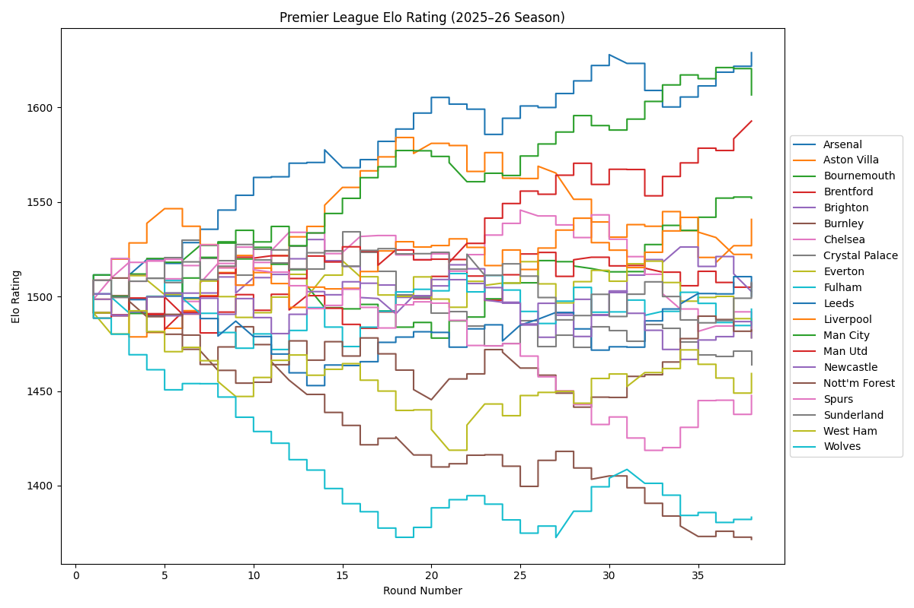
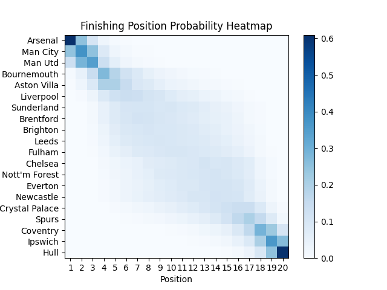

Premier League 2026–27 Season Simulator
I wrote a Monte Carlo forecasting model, simulated 10,000 times, for the 2026–27 Premier League season. I based match predictions off of elo ratings. This project outputs title, top-4, and relegation probabilities for each team, and a heat map highlighting finishing positions for each team.

1. Data
epl-2025-26-results.csv  
Contains date, venue, home and away teams, and final results for all matches in the 2025–26 Premier League Season.

epl-2026-27-fixtures.csv  
Contains date, venue, home and away teams for all the fixtures for the 2026–27 Premier League Season.

2. Methodology
The first step was to get the initial elo ratings for each team for the 2026–27 season. I ran through the results of the 2025–26 season csv and updated the elos of each team after each result. I initialized each team's elo to 1500, and by the end of the season I had a 300 elo point spread, with teams ranging from 1300–1600. I then added custom elos for the three promoted teams. I gave the EFL Championship winner, runner-up, and playoff winner 1420, 1400, and 1380 elo points respectively.

In this simulation, I had to simulate each match. Using the elo formula, I calculated the win probabilities for each team in a match. Draws had to be taken into consideration, so I set a fixed draw probability to 20% to adjust each teams win probabilities for a match. A random number between 0–1 was randomly generated to decide the outcome of a match. The outcomes were either a 0–0 draw or a 1–0 win for one of the teams. The match outcomes were used to update the elos after each match, not for goal difference or for a league table. The league table was calculated by using expected points per match, 3 times the probability of a win plus the probability of a draw.

I use a loop to simulate the season 10,000 times, recording the amount of title wins, top 4 finishes, and relegations for each team, as well as specific table positions. After running the code, title, top-4, and relegation probabilities for each team are printed and a heatmap is produced showing the probability of finishing in each position. The darker the cell, the more likely that team is to finish in that position.

3. Errors and Future Improvements
One thing I did not account for was the summer transfer window or any changes to teams during the offseason. I based starting elos completely off of the previous season’s results and no other factors. For example, Spurs have spent lots of money improving their squad in the transfer window, and their elo should be higher than the end of last season given these changes. I also gave the promoted teams relatively low elos as well. This is why the heat map looks roughly symmetrical and why teams like Hull or Coventry don't even have a tiny probability of top 4.

Another improvement could be changing the fixed draw probability. It is unlikely draw probability will be 20% for every single match, so having it variable based on team strength or time of season could make this prediction model stronger.

A few other improvements can include exact score predictions instead of 1–0 or 0–0 defaults, momentum effects, and individual player effects.
## 2025–26 Elo Ratings

## Monte Carlo Results Heatmap

